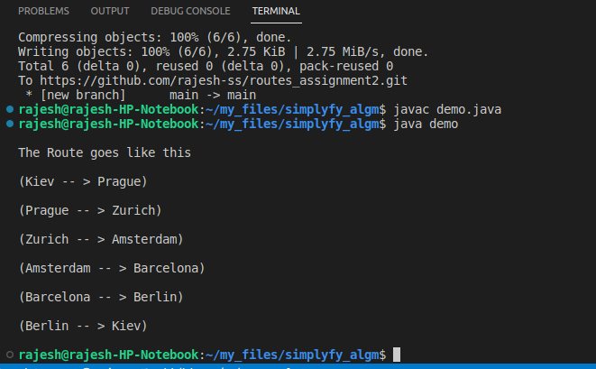

<!DOCTYPE html>
<html lang="en">
<head>
    <meta charset="UTF-8">
    <meta http-equiv="X-UA-Compatible" content="IE=edge">
    <meta name="viewport" content="width=device-width, initial-scale=1.0">
</head>
<body>
    <h2>Question: Your son took a vacation through Europe without telling you. When the kid returned from the vacation you asked him where did he go. The kid told you: Dad I went to these cities: Amsterdam, Kiev, Zurich, Prague, Berlin, Barcelona.
        I used only train as transportation and these were the available tickets:
        Paris-Skopje, Zurich-Amsterdam, Prague-Zurich, Barcelona-Berlin, Kiev-Prague, Skopje-Paris, Amsterdam-Barcelona, Berlin-Kiev, Berlin-Amsterdam.
        You know that your kid started with Kiev
        Write a data structure and algorithm that will give you the route which your son was traveling.</h2>
        <h2>Data structure used: Graph</h2>
        <h2>Algorithm used is Depth first search</h2>
        <h2>Explanation: </h2>
        
The given places are stored in each node of the graph, where there are stored in the adjacency matrix.

        
Eg. [src1: [dest1, dest2, ..], src2: [dest4, ...], ...]

        <h2>Screenshot</h2>
</body>
</html>

